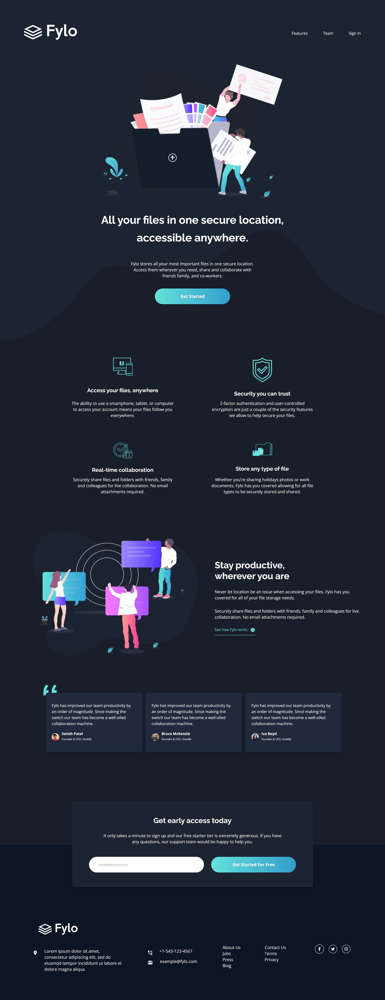

# Frontend Mentor - Fylo dark theme landing page solution

This is a solution to the [Fylo dark theme landing page challenge on Frontend Mentor](https://www.frontendmentor.io/challenges/fylo-dark-theme-landing-page-5ca5f2d21e82137ec91a50fd). Frontend Mentor challenges help you improve your coding skills by building realistic projects. 

## Table of contents

- [Overview](#overview)
  - [The challenge](#the-challenge)
  - [Screenshot](#screenshot)
  - [Links](#links)
- [My process](#my-process)
  - [Built with](#built-with)
  - [What I learned](#what-i-learned)
- [Author](#author)

## Overview

### The challenge

Users should be able to:

- View the optimal layout for the site depending on their device's screen size
- See hover states for all interactive elements on the page

### Screenshot

### Links

- Solution URL: [My solution on Frontend Mentor](https://www.frontendmentor.io/solutions/results-summary-component-react-and-next-js-1l9uM-4xbg)
- Live Site URL: [See my solution running](https://results-summary-component-main-henna-chi.vercel.app/)

## My process

### Built with

- Semantic HTML5 markup
- Flexbox
- CSS Grid
- Mobile-first workflow
- [React](https://reactjs.org/) - JS library
- [Next.js](https://nextjs.org/) - React framework
- [Tailwind CSS](https://tailwindcss.com/) - For styles

### What I learned

The development of this landing page using Next.js and Tailwind CSS was an opportunity to learn and apply a variety of fundamental concepts in web development. From performance optimization to creating reusable components, each step brought valuable lessons. I'm excited to continue honing my skills by exploring more projects.

## Author

- Frontend Mentor - [@nascimentolds](https://www.frontendmentor.io/profile/nascimentolds)
